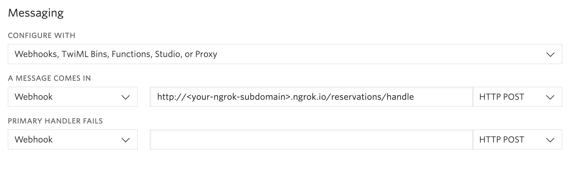

<a href="https://www.twilio.com">
  
</a>

# AirTNG App: Part 1 - Workflow Automation with Twilio with Node.js and Express
> We are currently in the process of updating this sample template. If you are encountering any issues with the sample, please open an issue at [github.com/twilio-labs/code-exchange/issues](https://github.com/twilio-labs/code-exchange/issues) and we'll try to help you.

[](https://travis-ci.org/TwilioDevEd/airtng-node)

Learn how to automate your workflow using Twilio's REST API and Twilio SMS. This example app is a vacation rental site, where the host can confirm a reservation via SMS.

[Read the full tutorial here](https://www.twilio.com/docs/tutorials/walkthrough/workflow-automation/node/express)!

## Local Development

1. You will need to configure Twilio to send requests to your application when SMS are received.

   You will need to provision at least one Twilio number with sms capabilities so the application's users can make property reservations. You can buy a number [right here](https://www.twilio.com/user/account/phone-numbers/search). Once you have a number you need to configure your number to work with your application. Open [the number management page](https://www.twilio.com/user/account/phone-numbers/incoming) and open a number's configuration by clicking on it.

   Remember that the number where you change the _SMS webhook_ must be the same one you set on the `TwilioPhoneNumber` setting.

   

   To start using `ngrok` in our project you'll have to execute to the following line in the _terminal_.

   ```bash
   ngrok http 3000
   ```

   Keep in mind that our endpoint is:

   ```
   http://<your-ngrok-subdomain>.ngrok.io/reservations/handle
   ```

2. This sample application stores data in a [MongoDB](https://www.mongodb.org/) database using [Mongoose](http://mongoosejs.com/). You can download and run MongoDB yourself (OS X, Linux, Windows).

   On OS X, maybe the easiest way to get MongoDB running locally is to install via [Homebrew](http://brew.sh/).

   ```bash
   brew install mongodb
   ```
   You should then be able to run a local server with:

   ```bash
   mongod
   ```

3. Clone this repository and `cd` into it.

   ```bash
   git clone git@github.com:TwilioDevEd/airtng-node.git
   cd airtng-node
   ```

4. Install the dependencies.

   ```bash
   npm install
   ```

5. Copy the sample configuration `.env.example` to `.env`, and then edit `.env` to match your configuration.

  ```bash
  cp .env.example .env
  ```

  You can find your `TWILIO_ACCOUNT_SID` and `TWILIO_AUTH_TOKEN` in your
   [Twilio Account Settings](https://www.twilio.com/console).
   You will also need a `TWILIO_PHONE_NUMBER`, which you may find [here](https://www.twilio.com/console/phone-numbers/incoming).

6. Run the application.

  ```bash
  npm start
  ```

7. Check it out at [http://localhost:3000](http://localhost:3000)

That's it!

To let our Twilio Phone number use the callback endpoint we exposed, our development server will need to be publicly accessible. [We recommend using ngrok to solve this problem](https://www.twilio.com/blog/2015/09/6-awesome-reasons-to-use-ngrok-when-testing-webhooks.html).

## Run the tests

You can run the tests locally by typing

```bash
npm test
```

## Meta

* No warranty expressed or implied. Software is as is. Diggity.
* The CodeExchange repository can be found [here](https://github.com/twilio-labs/code-exchange/).
* [MIT License](http://www.opensource.org/licenses/mit-license.html)
* Lovingly crafted by Twilio Developer Education.
